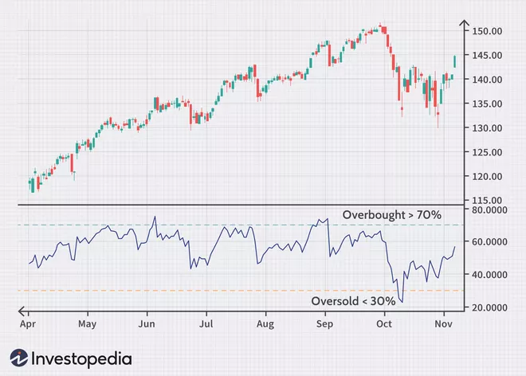
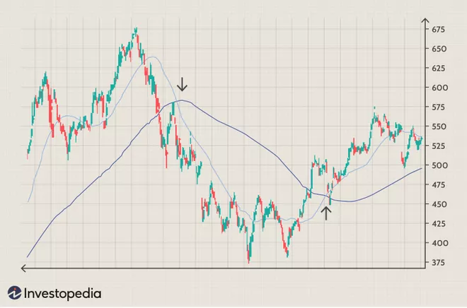
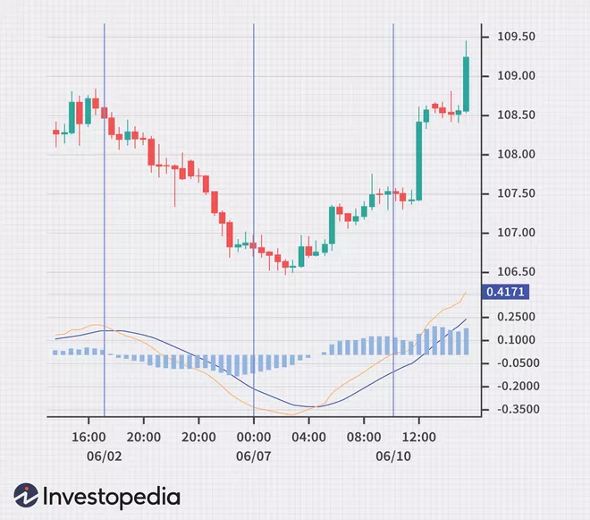
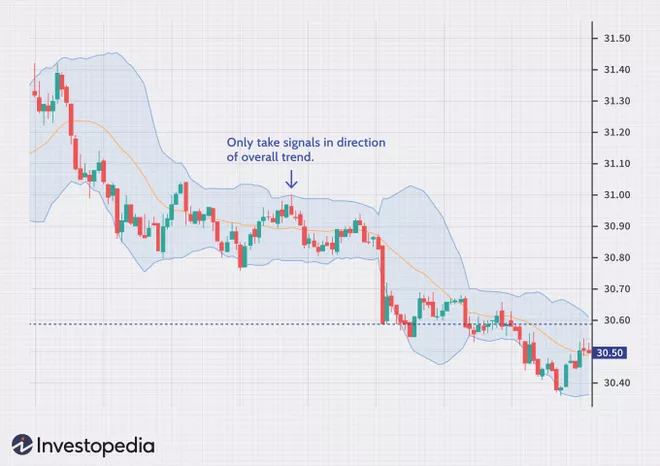

# Trading Strategies

Here we give a detailed description of the trading strategies supported by FutuBot for users who are not familiar with any of them. FutuBot currently supports the following strategies:

- [RSI Strategy](#RSI-Strategy)
- [Moving Average Strategy](#Moving-Average-Strategy)
- [MACD Crossover Strategy](#MACD-Crossover-Strategy)
- [Bollinger Bands Strategy](#Bollinger-Bands-Strategy)

## RSI Strategy

The RSI strategy relies on the Relative Strength Index (RSI), which measures the speed and magnitude of a security's recent price changes to evaluate overvalued or undervalued conditions in the price of that security \[1\]. It was developed by J. Welles Wilder Jr. in 1978 and takes values on a scale of 0 to 100. You can learn more about how RSI is calculated on [Investopedia](https://www.investopedia.com/terms/r/rsi.asp).

In RSI strategy, a market is oversold when the RSI is under 30, where a buy signal is generated if there is no current holding. On the other hand, a market is overbought when the RSI is above 70, where a sell signal is generated if there is current holding (Figure 1). A 80/20 RSI pair is also commonly used.

<figure>

Figure 1: RSI strategy. A buy signal is triggered when the RSI is below 30 (oversold level), and a sell signal is triggered when the RSI is above 70 (overbought level). (Image courtesy of Investopedia)

</figure>

## Moving Average Strategy

A Moving Average (MA), whether it is a Simple Moving Average (SMA) or an Exponential Moving Average (EMA), smooths out the random fluctuation of price data by averaging it over a specific period of time (e.g. 5 days, 20 minutes). One common MA strategy is to identify crossovers between two moving averages with different periods. A buy signal is generated when the short-term MA crosses above the long-term MA (the Golden Cross), as it indicates an uptrend. A sell signal is generated when the short-term MA crosses below the long-term MA (the Death Cross), as it indicates a downtrend (Figure 2) \[2\]. There are also [other strategies](https://www.investopedia.com/articles/active-trading/052014/how-use-moving-average-buy-stocks.asp) built around MA.

<figure>

  

Figure 2: MA Crossover strategy. The pale blue line is the short-term MA, and the dark blue line is the long-term MA. A sell signal is triggered when the short term MA crosses below the long-term MA (first crossover), and a buy signal is triggered when the short-term MA crosses above the long-term MA (second crossover). (Image courtesy of Investopedia)

</figure>

## MACD Crossover Strategy

MACD stands for Moving Average Convergence Divergence. It is calculated by taking the difference between a fast EMA and a slow EMA. The faster EMA usually has a period of 12 whereas the slower one has a period of 26. In MACD Crossover strategy, a signal line is also produced by taking the EMA of the MACD line (usually with a period of 9). A buy signal is generated when the MACD line crosses above the signal line, and a sell signal is generated when the MACD line crosses below the signal line (Figure 3). Normally, a histogram of the difference between the MACD and signal line is also plotted. The histogram is positive when the MACD is above its signal line and negative when the MACD is below its signal line. If prices are rising, the histogram grows larger as the speed of the price movement accelerates, and contracts as price movement decelerates. The same principle works in reverse as prices are falling \[3\].

<figure>

  
  

  
Figure 3: MACD Crossover strategy. The orange line is the MACD line and the blue line is the signal line. A sell signal is triggered when the MACD line crosses below the signal line (first crossover), and a buy signal is triggered when the MACD line crosses above the signal line (second crossover). A histogram of the difference between the MACD and signal line is also plotted. (Image courtesy of Investopedia)

</figure>

## Bollinger Bands Strategy

Bollinger Bands consist of three lines. The middle line is the SMA of the close prices, usually with a period of 20. The upper and lower line are calculated by adding and subtracting twice the standard deviation of the close prices, respectively.

One Bollinger Bands strategy relies on mean reversion, which assumes that if the price deviates substantially from the mean or average, it eventually reverts back to the mean price. Overbought and oversold conditions can then be identified based on this: when the price breaks below the lower Bollinger Band, prices have perhaps fallen too much and are due to bounce. On the other hand, when price breaks above the upper band, the market is perhaps overbought and due for a pullback (Figure 4) \[4\].

<figure>

  
  

  
Figure 4: Bollinger Bands strategy. The Bollinger Bands region is filled with pale blue. A sell signal is triggered when the close price breaks above the upper line, and a buy signal is triggered when the close price breaks below the lower line. (Image courtesy of Investopedia)

</figure>

#### References

- \[1\] https://www.investopedia.com/terms/r/rsi.asp

- \[2\] https://www.investopedia.com/articles/active-trading/052014/how-use-moving-average-buy-stocks.asp

- \[3\] https://www.investopedia.com/articles/forex/05/macddiverge.asp

- \[4\] https://www.investopedia.com/trading/using-bollinger-bands-to-gauge-trends/#:~:text=Bollinger%20Bands%C2%AE%20are%20a%20trading%20tool%20used%20to%20determine,lot%20of%20other%20relevant%20information.
